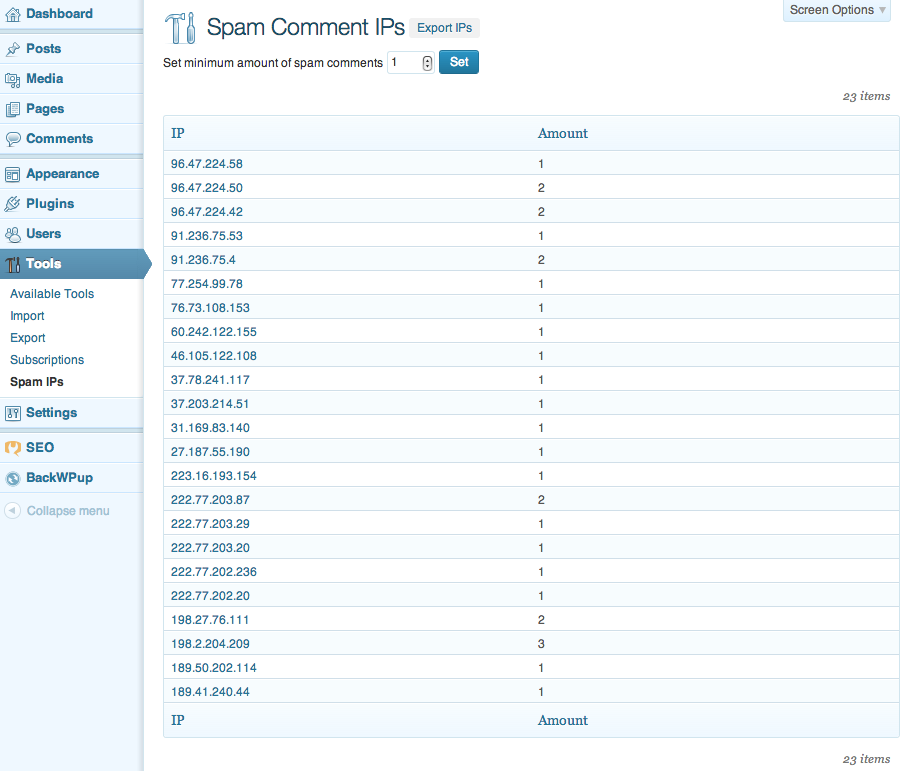

# Top Spam IPs

A WordPress plugin that collects the Top Spam IP addresses and lists them on a new admin
tools page. Allows to export them and to block via your `.htaccess` file.

## Contributions

This repo is widely open to _any_ sort of contribution.

Here's a list of things that need to get done:

 * A better readme file here
 * Translation into other languages (German, Mandarin Chinese & Nederlands already done)
 * Make a better export screen:
 	A) Add `deny from` to every line
 	B) Add open/close for block `order allow,deny` and `allow from all`.
 	C) Add an algorithm that checks for ranges and summons them under `deny from 012.34.5.`
 * ✓ Screenshots both for the dot org txt file as well as for this file
 * ✓ Generate main translation files

Translators: Lutz Schöer (de), Piet Bos (zh,nl)

### Ideas how this repo could move forward

This is just a rough draft and should be discussed in either a milestone or a (set) of ticket(s).

 * Automatically add all or just a single IP to the `.htaccess`
 * Remove a single IP (or all) from the `.htaccess`
 * Clean `.htaccess` on uninstall
 * Central storage for IP addresses, similar to project honeypot
 * Remote connection to send the IPs there

## Thank you!

Thanks in advance for any contributions. Your work will be honored with a link to your
wordpress dot org profile in the "Contributors" section of the Readme file.

A big _thank you!_ goes to [Thomas _"toscho"_ Scholz](http://toscho.de/)
for allowing us to use his IP-Whois service in the plugin for free.

## HowTo block IP addresses

…or IP ranges via the `.htaccess` file.

```
	# Start IP block
	order allow,deny
	# Block single IP example
	deny from 123.45.6.7
	# Block IP range example
	deny from 012.34.5.
	allow from all
	# End IP block
```

Make sure that you _don't delete spam_, but just mark it as such.
The [AntiSpam Bee](http://wordpress.org/plugins/antispam-bee/) plugin by Sergej M&uuml;ller,
who contributes to this project as well, does a great job and we highly recommended to use this
plugin to collect spam IPs.

## Screenshots

A short preview with too less Spam IP addresses.


---

---
